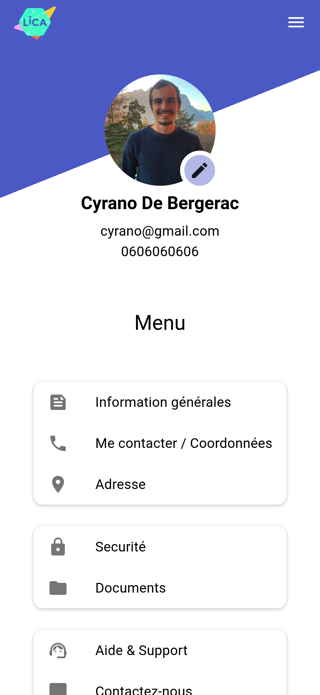
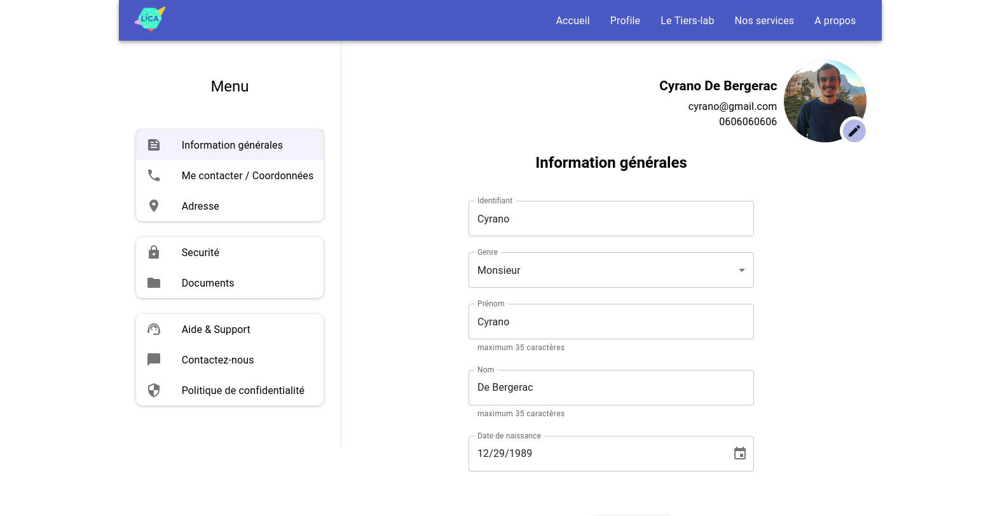

# Little Mui project

Here is my very first project with Materal UI. (pretty cool library by the way)

### Browser used/support: Firefox developer edition 109.0b7 (64-bit)

Any other browser might not look like the desired design
(In Chrome, only the Samsung Galaxy S8+ device from the inspector window seems to behave as expected)

Designed by me (see two screenshots)

## Instructions

- The project should be developed with React and we should use the components of [MUI](https://mui.com) that implement Material UI as much as possible.

- Attached are the following screenshots:

1. [My profile screen 1](https://gitlab.com/LicaTech/test-dev/-/blob/main/Screen_Shot_2022-11-23_at_4.31.09_PM.png)
1. [My profile screen 2](https://gitlab.com/LicaTech/test-dev/-/blob/main/Screen_Shot_2022-11-23_at_4.31.16_PM.png)
1. [My documents section redirects to this view](https://gitlab.com/LicaTech/test-dev/-/blob/main/Screen_Shot_2022-11-23_at_4.39.30_PM.png)

This is a view of the profile information of a participant. The different information is organized in the following sections:

- Image
- Contact information
- General information
- Security
- Address
- My Documents (which redirects to another page)

**The mock-ups are given for information purposes and are NOT to be REPRODUCED.**

We want to reorganize this information to make it more readable/user-friendly.

GOAL: propose a new design and implement it using MUI components (custom components only if necessary).

- The UI should be compatible in mobile view following the mobile first principle.

- The colors/theme is free and use a Material palette of your choice, just make sure that it is pleasant to the eye ;).

- All the buttons("enregistrer" and "nouveau") of the screenshots should be present (NO action on click is required).

- To retrieve the data, use the file data.json. It should be loaded with a method [fetch](https://developer.mozilla.org/en-US/docs/Web/API/Fetch_API).

- The choice of the front end architecture is free and should be explained during the interview :)

- The code should be pushed on a branch named exercise-MyInitials-DateRendu, example exercise-FI-23112022
